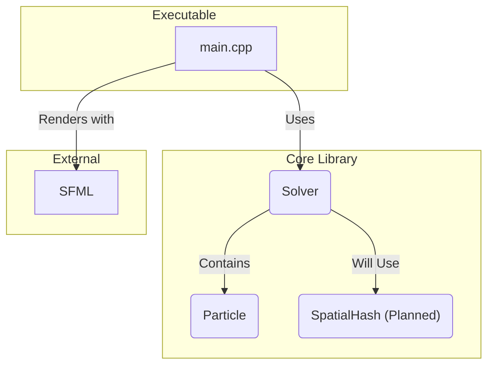

# C++ Particle Physics Engine

A high-performance 2D particle simulation built from scratch in modern C++. This project serves as a hands-on journey into computational physics, performance optimization, and low-level systems programming.

---

## 🚀 Development Status & Roadmap

This project is being built incrementally, milestone by milestone. The current focus is on creating a robust and optimized CPU-based physics engine.

### **Phase 1: CPU Simulation Engine**

- [x] **Stage 1:** Setup professional C++ project with CMake
- [x] **Stage 2:** Render a window using the SFML library
- [x] **Stage 3:** Implement basic Euler physics integration
- [x] **Stage 4:** Refactor code into a modular library structure
- [x] **Stage 5:** Implement boundary constraints (bouncing)
- [x] **Stage 6:** Refactor physics to use Verlet integration
- [x] **Stage 7:** Add diagnostics (FPS, particle count)
- [x] **Stage 8:** Implement naive O(n²) particle-particle collisions
- [ ] **Stage 9:** **(Current Focus)** Refactor physics logic into a `Solver` class
- [ ] **Stage 10:** Implement a Spatial Hash Grid to accelerate collisions to O(n)

### **Phase 2: GPU Acceleration (Planned)**

- [ ] **Stage 11:** Isolate and learn CUDA basics
- [ ] **Stage 12:** Port the physics update loop to a CUDA kernel
- [ ] **Stage 13:** Implement CUDA-OpenGL interoperability for direct rendering
- [ ] **Stage 14:** Optimize CUDA kernels using shared memory

---

## 🛠️ Build and Run

### **Prerequisites**

- A C++17 compatible compiler (GCC, Clang, MSVC)
- CMake (3.16+)
- SFML 3.0+

### **1. Configure CMake**

This command needs to be run once to set up the build directory. The `CMAKE_EXPORT_COMPILE_COMMANDS` flag is highly recommended as it generates a file that enables perfect autocompletion and error checking in your code editor (LSP).

```bash
cmake -S . -B build -DCMAKE_EXPORT_COMPILE_COMMANDS=ON
```

### **2. Build the Project**

To compile the code, run the following command from the project root. CMake will only rebuild files that have changed.

```bash
cmake --build build
```

### **3. Run the Example**

The executable will be located in the `build/bin` directory.

```bash
./build/bin/stage_01
```

---

## 🏗️ Architecture Overview

The project is structured as a core physics library (`particle_physics_core`) and an example executable (`stage_01`) that uses the library. The current architecture is:



---

## 📚 Learning Resources

- [LearnCpp.com](https://www.learncpp.com/) - C++ fundamentals
- [SFML Tutorials](https://www.sfml-dev.org/tutorials/2.6/)
- [Real-Time Collision Detection](http://realtimecollisiondetection.net/) by Christer Ericson

---

## 📝 License

This project is licensed under the MIT License. See the `LICENSE` file for details.
